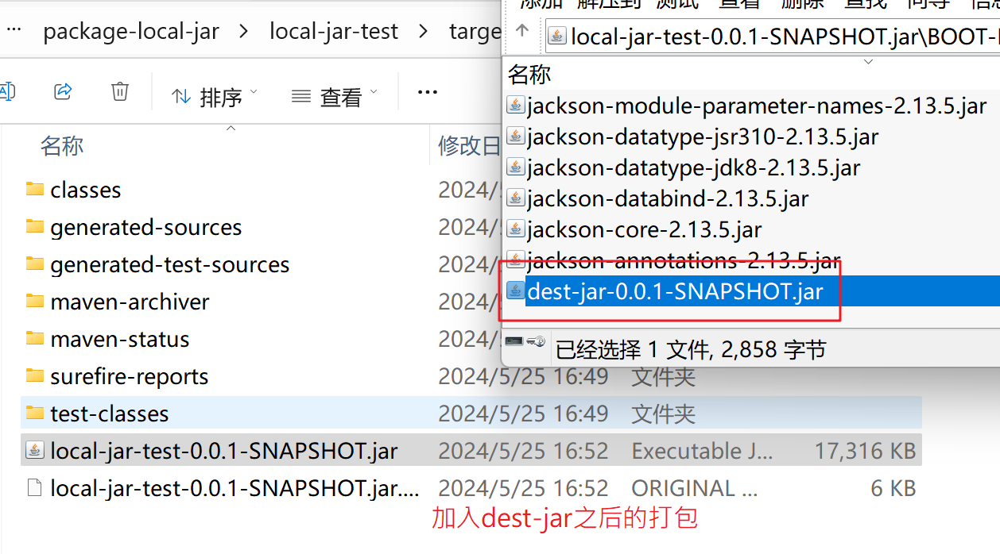

# Getting Started

### 本地jar包加入库文件


### 使用本地jar文件


### 使用本地jar文件



### pom里面加入<build>配置
```xml
<build>
        <plugins>
            <plugin>
                <groupId>org.apache.maven.plugins</groupId>
                <artifactId>maven-compiler-plugin</artifactId>
                <version>3.1</version>
                <configuration>
                    <source>${java.version}</source>
                    <target>${java.version}</target>
                    <encoding>${project.build.sourceEncoding}</encoding>
                </configuration>
            </plugin>
            <!-- 1、includeSystemScope指名要将使用了<scope>system</scope>标签的依赖打进本项目的jar包 -->
            <plugin>
                <groupId>org.springframework.boot</groupId>
                <artifactId>spring-boot-maven-plugin</artifactId>
                <configuration>
                    <includeSystemScope>true</includeSystemScope>
                </configuration>
            </plugin>
        </plugins>
        <resources>
            <!-- 2、指名jar包的位置 -->
            <resource>
                <directory>${project.basedir}/lib</directory>
                <targetPath>BOOT-INF/lib/</targetPath>
                <filtering>false</filtering>
                <includes>
                    <include>**/*.jar</include>
                </includes>
            </resource>
            <resource>
                <directory>src/main/resources</directory>
                <filtering>true</filtering>
            </resource>
        </resources>
    </build>
```

### 打包运行
```mvn clean package```

